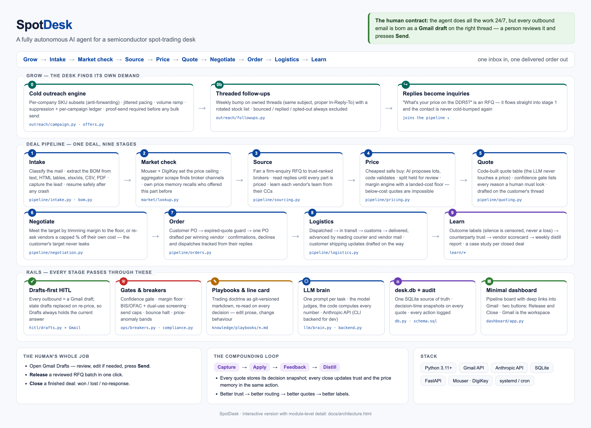
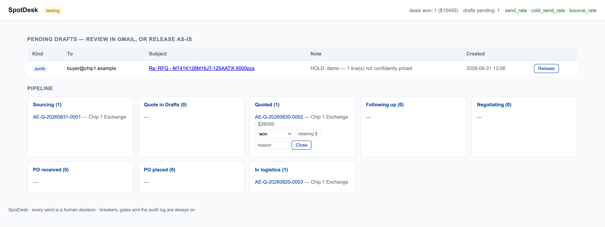

<div align="center">

# SpotDesk

**A fully autonomous AI agent for a semiconductor spot-trading desk.**

It finds demand, quotes it, negotiates it, buys it, ships it - and learns from every
outcome. Every email it wants to send lands as a Gmail draft; a human presses Send.

</div>



<sub>Want it clickable? Open [`docs/architecture.html`](docs/architecture.html) in a
browser - the same diagram with module-level detail behind every box.</sub>

## Run it

```bash
python3 -m venv .venv && ./.venv/bin/pip install -r requirements.txt
cp .env.example .env               # mailbox · ANTHROPIC_API_KEY · MOUSER_API_KEY
python main.py --setup             # one-time Gmail OAuth
python main.py                     # agent + dashboard → http://localhost:8080
```

Ships in **testing mode**: the agent drafts everything and sends nothing on its own.
No credentials yet? See it anyway:

```bash
./.venv/bin/python scripts/seed_demo.py && python main.py --dashboard
```

## Operate it - the whole job

| You do | Where |
|---|---|
| Review what the agent drafted, press **Send** | Gmail Drafts - always the current answer |
| **Release** a reviewed RFQ batch in one click | dashboard, or `desk release --deal AE-Q-…` |
| **Close** a finished deal with its outcome | dashboard, or `desk close AE-Q-… won 15400 "PO received"` |
| Everything else | `desk status` · `desk lookup <MPN>` · `desk campaign` · `desk distill` |

`desk` = `./.venv/bin/python -m spotdesk.cli` (alias it). Go-live runbook:
[`deploy/DEPLOY.md`](deploy/DEPLOY.md).



<sub>The whole dashboard. Everything else happens inside Gmail - deliberately.</sub>

## Map

```
spotdesk/
├── pipeline/     intake → sourcing → pricing → quoting → negotiation → orders → logistics
├── outreach/     cold campaigns · offer pool · threaded follow-ups
├── learn/        outcomes · trust · vendor scorecard · weekly distill
├── hitl/         the drafts-first layer (create · supersede · release · reconcile)
├── llm/          every prompt + the pluggable Anthropic backend
├── market/       Mouser · DigiKey · OEMsTrade · price memory · FX
├── knowledge/    playbooks · line card · compliance screening
├── ops/          circuit breakers · health
├── dashboard/    the one-page board
└── schema.sql    one SQLite source of truth + audit log
```

The playbooks are plain markdown - edit
[`spotdesk/knowledge/playbooks/`](spotdesk/knowledge/playbooks) and the agent behaves
differently on its next decision. No deploy.

## Tests

```bash
./.venv/bin/python -m pytest tests/ -q     # 39 passed
```

Allocation, the margin-guard floor, every confidence-gate hold, breakers, BOM merging,
offer rotation, and the outcome → trust flywheel (censoring included).

---

<sub>Built for and proven on a real desk: a semiconductor components
distributor - memory, CPUs, storage and broadline ICs, traded between a
HK/CN/SG/IN/EU broker panel and a global buyer book.</sub>
